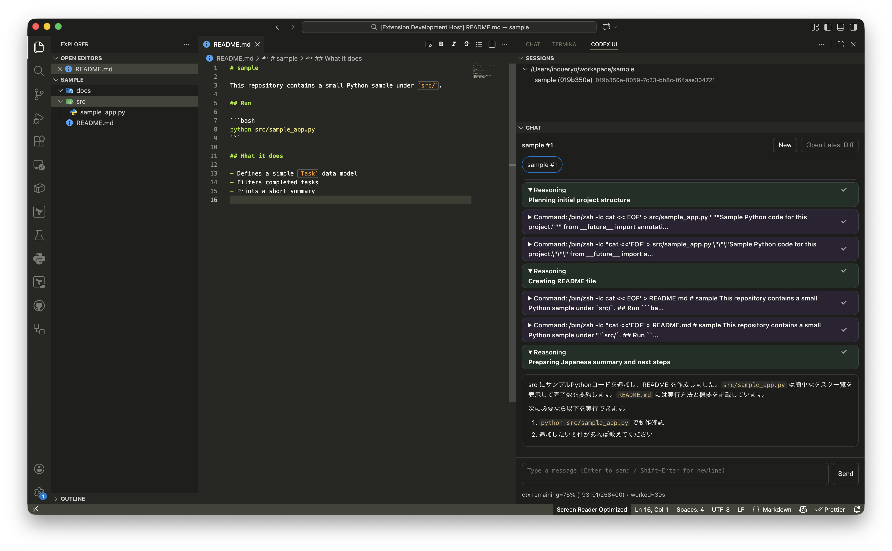

# Codex UI (VS Code Extension)

Use Codex-style CLIs inside VS Code: sessions, chat, tools, diffs.

This extension:

- Starts / connects to a backend per workspace folder
- Manages sessions (create, switch, rename, hide)
- Renders chat output and tool activity (commands, file changes, diffs, approvals)

## Supported backends

You can choose a backend per session:

- **`codex`**: upstream Codex CLI (via `codex app-server`)
- **`opencode`**: OpenCode (via `opencode serve`)

Important notes:

- `codex` and `opencode` use different history formats/protocols. History is not shared across these backends, and sessions are kept separate.

## Prerequisites

This extension **does not bundle any CLI**. Install the backends you want to use and make sure they are available in your `PATH`:

- `codex` `>= 0.110.0` (for the `codex` backend)
- Recommended stable: `codex` `>= 0.116.0`
- `opencode` (for the `opencode` backend)

Or set absolute paths via settings (see below).

## Usage



1. Open the Activity Bar view: **Codex UI**
2. Click **New** to create a session (you can pick `codex` / `opencode`)
3. Type in the input box (Enter = send, Shift+Enter = newline)
4. Switch sessions from **Sessions** or the chat tab bar

## Feature notes

- **Rewind/Edit**: supported for `codex` and `opencode` sessions.
- **Accounts / login UI**: available on `codex` sessions (`opencode` does not use the same account flow).
- **ChatGPT login**: on `codex` sessions, Settings supports both browser login and device-code login.
- **Account create/switch** (`account/list`, `account/switch`) is not supported in this extension.
- **Fast tier**: use `/fast` to switch the codex session service tier (`fast`, `flex`, or default).
- **Plugins**: use `/plugins install <marketplace> <plugin>`, `/plugins list`, and `/plugins uninstall <pluginId>` on codex sessions.
- **MCP approvals**: MCP permission requests and MCP elicitation-based tool approvals are supported in the codex backend.
- **Codex version policy**: versions below `0.116.0` are treated as deprecated. They may still work for basic flows, but new features and compatibility work target `0.116.0+`.
- **OpenCode tool output**: rendered as Step/Tool cards optimized to avoid tool-spam.

## Settings

- `codex.cli.commands.codex`
  - Default: `codex`
  - If `codex` is not in your `PATH`, set an absolute path.
- `codex.backend.args`
  - Default: `["app-server"]`
  - Arguments passed to the `codex` backend command.
- `codex.opencode.command`
  - Default: `opencode`
- `codex.opencode.args`
  - Default: `["serve"]`
  - Arguments passed to the `opencode` backend command.

## Development

1. Install dependencies

   ```bash
   pnpm install
   ```

2. (Re)generate protocol bindings (if missing / after protocol changes)

   ```bash
   cd ../codex-rs && cargo build -p codex-cli
   cd ../vscode-extension && pnpm run regen:protocol
   ```

3. Build

   ```bash
   pnpm run compile
   ```

4. Run in VS Code
   - Open this repo in VS Code
   - Run the debug configuration: **Run Extension (Codex UI)**

## Publishing (VS Code Marketplace)

1. Update `package.json` (`version`)
2. Package

   ```bash
   pnpm run vsix:package
   ```

3. Publish

   ```bash
   pnpm run vsce:publish
   ```

Note: `--no-dependencies` を付けると、`.vscodeignore` で opt-in していても `node_modules/` が VSIX に入らず、
起動時に `Cannot find module` でクラッシュします（少なくとも `@iarna/toml` / `shell-quote` が必要）。

## Specification

See `docs/spec.md`.

## Support

If you find this extension useful, you can support development via Buy Me a Coffee:

- https://buymeacoffee.com/harukary7518
